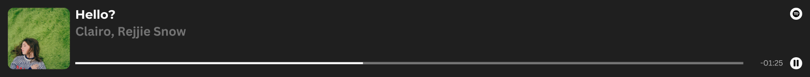
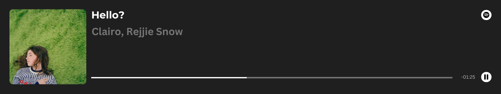

## Sup Bro, I'm Erlang Andriyanputra👋

#### Educations

- ✏️ SDN Sungai Jingah 6 Banjarmasin (2013 - 2019)
- 🖋️ SMPN 27 Banjarmasin (2019 - 2022)
- 💻 SMKN 2 Banjarmasin (2022 - 2025)

#### Tools

          	  	        	    

<!--  -->
